<div align="center">

<!-- BANNER_START -->

<!-- BANNER_END -->

[![Contributors][contributors-shield]][contributors-url]
[![Forks][forks-shield]][forks-url]
[![Stargazers][stars-shield]][stars-url]
[![Issues][issues-shield]][issues-url]
[![MIT License][license-shield]][license-url]
[![LinkedIn][linkedin-shield]][linkedin-url]

</div>

<a name="readme-top"></a>

<h3 align="center">Tradingview To EXCH API</h3>

<p align="center">
  Django REST bridge between TradingView webhook alerts and the Binance API.
<br /><br />
<a href="docs/0_SYSTEM_OVERVIEW.md"><strong>Explore the docs »</strong></a>
<br />
·
<a href="https://github.com/GstMirabal/Tradingview2EXCH/issues/new?labels=bug&template=bug-report---.md">Report Bug</a>
·
<a href="https://github.com/GstMirabal/Tradingview2EXCH/issues/new?labels=enhancement&template=feature-request---.md">Request Feature</a>
</p>

<!-- TABLE OF CONTENTS -->
<details>
  <summary>Table of Contents</summary>
  <ol>
    <li>
      <a href="#about-the-project">About The Project</a>
      <ul><li><a href="#built-with">Built With</a></li></ul>
    </li>
    <li>
      <a href="#getting-started">Getting Started</a>
      <ul>
        <li><a href="#prerequisites">Prerequisites</a></li>
        <li><a href="#installation">Installation & Configuration</a></li>
        <li><a href="#running-with-docker">Running with Docker</a></li>
      </ul>
    </li>
    <li><a href="#usage">Usage</a></li>
    <li><a href="#testing">Testing</a></li>
    <li><a href="#governance--architecture-docs">Governance & Architecture Docs</a></li>
    <li><a href="#contributing">Contributing</a></li>
    <li><a href="#license">License</a></li>
    <li><a href="#contact">Contact</a></li>
  </ol>
</details>

## About The Project

This project receives TradingView alerts over a passphrase-gated webhook and executes the corresponding order on Binance. It's a single Django project (`backend/`) with a Service Layer wrapping the `binance-connector` SDK, security-hardened settings, and a SQLite database.

### Key Features:
- **Modular Structure**: separate apps for webhook intake (`Webhook_Receiver`) and Binance execution (`Binance_Connector`).
- **Service Layer Architecture**: order execution logic lives in `BinanceService`, decoupled from the views.
- **Security**: constant-time passphrase check, `IsAdminUser`-gated direct order endpoint, CSP/HSTS/CORS headers, idempotent webhook processing (a repeated `order_id` is rejected, never re-executed).
- **Structured Logging**: configurable JSON/text logs with rotation.
- **Auto-Doc**: Swagger/Redoc UI, served only when `DEBUG=True`.

### Built With

[](https://www.python.org/)
[](https://www.djangoproject.com/)
[](https://www.binance.com/)
[](https://www.sqlite.org/)

<p align="right">(<a href="#readme-top">back to top</a>)</p>

## Getting Started

### Prerequisites

- Python 3.12+
- Pip & venv
- Binance API Keys (with Trading permissions enabled)

### Installation & Configuration

1. **Clone the repository**
   ```bash
   git clone https://github.com/GstMirabal/Tradingview2EXCH.git
   cd Tradingview2EXCH
   ```

2. **Configure Environment Variables**
   - Copy `.env.example` to `.env` and `config.toml.example` to `config.toml`.
   - Fill in `.env`:
     - `DJANGO_SECRET_KEY`: a freshly generated key (`python -c 'from django.core.management.utils import get_random_secret_key; print(get_random_secret_key())'`).
     - `WEBHOOK_PASSPHRASE`: a secret string to validate incoming webhooks.
     - `API_KEY` / `API_SECRET`: your Binance credentials.
   - The database is SQLite only — `SQLITE_NAME` controls where the file lives; there is no Postgres/MySQL support.

3. **Install Dependencies**
   ```bash
   python -m venv venv
   source venv/bin/activate  # On Windows: venv\Scripts\activate
   pip install -r requirements.txt
   ```

4. **Initialize & Run**
   ```bash
   python backend/manage.py migrate
   python backend/manage.py runserver
   ```

<p align="right">(<a href="#readme-top">back to top</a>)</p>

### Running with Docker

`docker-compose.yml` defines a single `web` service (SQLite needs no separate database container):

```bash
docker-compose up --build
```

The SQLite file persists in the `sqlite_data` named volume across `docker-compose down`.

**Production note**: with `DEBUG=False`, `SECURE_SSL_REDIRECT` is on and gunicorn itself never terminates TLS — put a reverse proxy (nginx, Traefik, a cloud load balancer) in front that forwards `X-Forwarded-Proto`, or every request redirect-loops. If you're running gunicorn directly with no such proxy, set `SECURE_SSL_REDIRECT = False` in `settings.py` instead.

<p align="right">(<a href="#readme-top">back to top</a>)</p>

## Usage

The API provides two Binance-facing endpoints, plus a status check:

### 1. Webhook Receiver
- **Endpoint**: `POST /webhook-receiver/webhook/`
- **Security**: requires a `passphrase` field in the JSON body matching your `.env` configuration.
- **Idempotency**: a repeated `order_id` is rejected (`400`) rather than executed twice.
- **Example Payload**:
  ```json
  {
    "passphrase": "your_secret_passphrase",
    "symbol": "{{ticker}}",
    "side": "BUY",
    "type": "MARKET",
    "size": "0.001",
    "exchange": "BINANCE",
    "time": "{{time}}",
    "interval": "{{interval}}",
    "price": "{{close}}",
    "order_id": "TV_ALERT_1",
    "market_position": "{{strategy.market_position_size}}",
    "market_prev_position": "{{strategy.prev_market_position_size}}"
  }
  ```

#### How to Configure in TradingView:
1. **Alert Message**: use the payload above as your TradingView alert's "Message" field, substituting the placeholders.
2. **Webhook URL**: set your alert's Webhook URL to `http://your-server-ip:8000/webhook-receiver/webhook/`.

### 2. Binance Connector (Internal/Direct)
- **Endpoint**: `POST /binance-connector/binance-params/`
- **Security**: requires an authenticated Django staff session (`IsAdminUser`) — this is an internal tool, not part of the public webhook flow.
- **Purpose**: direct order submission outside the TradingView flow.

### 3. Status Check
- **Endpoint**: `GET /binance-connector/status/` (also `IsAdminUser`) — returns Binance system status and account assets.

### 4. API Documentation
When running with `DEBUG=True`:
- Swagger: `http://localhost:8000/swagger/`
- Redoc: `http://localhost:8000/redoc/`

<p align="right">(<a href="#readme-top">back to top</a>)</p>

## Testing

Run the full test suite from inside `backend/` (Django's bare `manage.py test` discovers relative to the current directory):

```bash
cd backend
python manage.py test
```

<p align="right">(<a href="#readme-top">back to top</a>)</p>

## Governance & Architecture Docs

This project is governed by the [`.agents`](https://github.com/GstMirabal/.agents) pipeline. For a deeper reference beyond this README:
- [`docs/0_SYSTEM_OVERVIEW.md`](docs/0_SYSTEM_OVERVIEW.md) — architecture entry point.
- [`docs/architecture/`](docs/architecture/) — per-module Blueprints (`CORE`, `BINANCE_CONNECTOR`, `WEBHOOK_RECEIVER`).
- [`docs/decisions/`](docs/decisions/) — ADRs recording architectural decisions.
- [`CHANGELOG.md`](CHANGELOG.md) — release history.

<p align="right">(<a href="#readme-top">back to top</a>)</p>

## Contributing

Contributions are what make the open source community such an amazing place to learn, inspire, and create. Any contributions you make are **greatly appreciated**.

1. Fork the Project
2. Create your Feature Branch (`git checkout -b feature/AmazingFeature`)
3. Commit your Changes (`git commit -m 'feat: Add some AmazingFeature'`)
4. Push to the Branch (`git push origin feature/AmazingFeature`)
5. Open a Pull Request

<p align="right">(<a href="#readme-top">back to top</a>)</p>

## License

Distributed under the MIT License. See `LICENSE.txt` for more information.

<p align="right">(<a href="#readme-top">back to top</a>)</p>

## Contact

Gustavo Mirabal Suarez - gst.mirabal@gmail.com

- LinkedIn: [@Gustavo-Mirabal](https://www.linkedin.com/in/gstmirabal/)
- GitHub: [@GstMirabal](https://github.com/GstMirabal)
- Twitter: [@GstMirabal](https://x.com/gst_mirabal)

Project Link: [https://github.com/GstMirabal/Tradingview2EXCH](https://github.com/GstMirabal/Tradingview2EXCH)

<p align="right">(<a href="#readme-top">back to top</a>)</p>

<!-- MARKDOWN LINKS & IMAGES -->
[contributors-shield]: https://img.shields.io/github/contributors/GstMirabal/Tradingview2EXCH.svg?style=for-the-badge
[contributors-url]: https://github.com/GstMirabal/Tradingview2EXCH/graphs/contributors
[forks-shield]: https://img.shields.io/github/forks/GstMirabal/Tradingview2EXCH.svg?style=for-the-badge
[forks-url]: https://github.com/GstMirabal/Tradingview2EXCH/network/members
[stars-shield]: https://img.shields.io/github/stars/GstMirabal/Tradingview2EXCH.svg?style=for-the-badge
[stars-url]: https://github.com/GstMirabal/Tradingview2EXCH/stargazers
[issues-shield]: https://img.shields.io/github/issues/GstMirabal/Tradingview2EXCH.svg?style=for-the-badge
[issues-url]: https://github.com/GstMirabal/Tradingview2EXCH/issues
[license-shield]: https://img.shields.io/github/license/GstMirabal/Tradingview2EXCH.svg?style=for-the-badge
[license-url]: https://github.com/GstMirabal/Tradingview2EXCH/blob/main/LICENSE.txt
[linkedin-shield]: https://img.shields.io/badge/-LinkedIn-black.svg?style=for-the-badge&logo=linkedin&colorB=555
[linkedin-url]: https://www.linkedin.com/in/gstmirabal/
